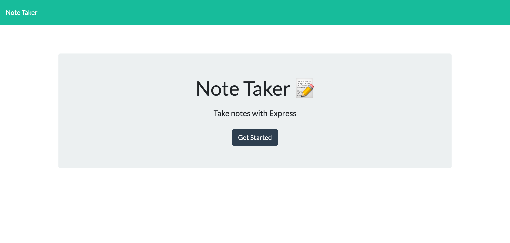
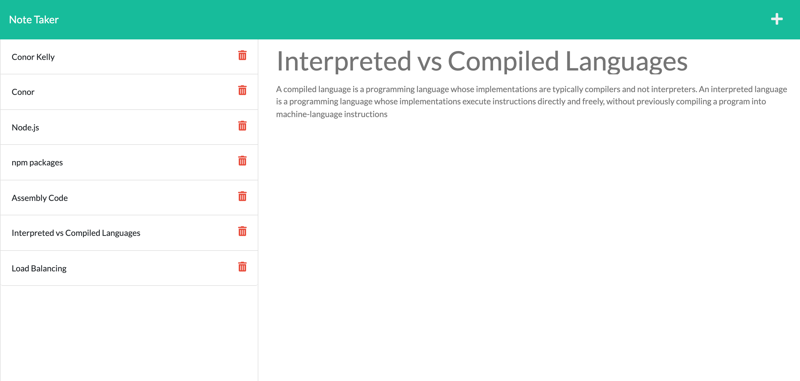

# Note Taker

## Description

A full stack web application allowing users to create, track and delete notes leveraging technologies such as express.js.

# Links

[Deployed Heroku link](https://dashboard.heroku.com/apps/infinite-forest-43221)

## User Stories

```
WHEN I open the Note Taker
THEN I am presented with a landing page with a link to a notes page

WHEN I click on the link to the notes page
THEN I am presented with a page with existing notes listed in the left-hand column, plus empty fields to enter a new note title and the note’s text in the right-hand column

WHEN I enter a new note title and the note’s text
THEN a Save icon appears in the navigation at the top of the page

WHEN I click on the Save icon
THEN the new note I have entered is saved and appears in the left-hand column with the other existing notes

WHEN I click on an existing note in the list in the left-hand column
THEN that note appears in the right-hand column

WHEN I click on the Write icon in the navigation at the top of the page
THEN I am presented with empty fields to enter a new note title and the note’s text in the right-hand column
```

## Technologies

- HTML
- CSS
- JavaScript
  - node.js
  - express.js

## Endpoints

When using the application, please see example responses on the GET, POST, PUT and DELETE requests.

## /api - routes and request samples

### GET /note

See sample response:

```json
[
  {
    "title": "Interpreted vs Compiled Languages",
    "text": "A compiled language is a programming language whose implementations are typically compilers and not interpreters. An interpreted language is a programming language whose implementations execute instructions directly and freely, without previously compiling a program into machine-language instructions",
    "id": "f3a0101f-326b-4c73-8394-15b3d14d3a2c"
  },
  {
    "title": "Load Balancing",
    "text": "Load balancing is defined as the methodical and efficient distribution of network or application traffic across multiple servers in a server farm. Each load balancer sits between client devices and backend servers, receiving and then distributing incoming requests to any available server capable of fulfilling them.",
    "id": "201f3edc-db61-455b-9cbd-a3d1a0f16a49"
  }
]
```

### POST /note

This will create a new note

See sample input into the POST body request:

```json
{
  "title": "Interpreted vs Compiled Languages",
  "text": "A compiled language is a programming language whose implementations are typically compilers and not interpreters. An interpreted language is a programming language whose implementations execute instructions directly and freely, without previously compiling a program into machine-language instructions"
}
```

### DELETE /notes/:id

This will delete a note by ID.

```javascript
// facilitating the DELETE request in the API routes
const deleteUserNotes = (req, res) => {
  try {
    const { id } = req.params;
    const noteToDelete = readFromFile("db").filter((note) => note.id !== id);
    writeToFile("db", noteToDelete);
    res.status(200).json({ message: "Your note has been deleted." });
  } catch (error) {
    console.error(error.message);
    res.status(500).json({ error: "Oops, something went wrong..." });
  }
};
```

## Screenshots

See below screenshots of the application.

Landing Page:



Note Taker Page:


